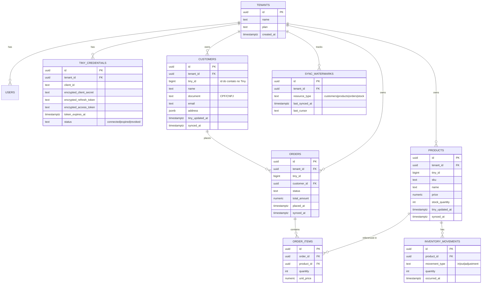

# Modelo de Dados

> **Nota de versão**: modelo bronze/silver e `sync_watermarks` permanecem como
> desenhados originalmente — validado e mantido na redefinição de arquitetura para
> Supabase Edge Functions. Ver `01-ARQUITETURA.md` para a arquitetura de execução.
> Ajustes desta revisão: sintaxe RLS fail-closed explícita (§3), tabela de fila do
> webhook (§5, nova) e observação sobre segredos via Supabase Vault em vez de
> Fernet (§3).

## 1. Estratégia: bronze/silver simplificado

Não é um data warehouse, mas vale roubar a ideia do padrão medallion em miniatura:

- **Bronze (`raw_tiny_payloads`)**: cópia exata do JSON que a API do Tiny devolveu,
  imutável, append-only, com `tenant_id`, `resource_type`, `resource_id`,
  `payload JSONB`, `fetched_at`. Serve para **replay** (se um bug de parsing for
  descoberto, você reprocessa sem chamar a API de novo) e para **auditoria**.
- **Silver (tabelas normalizadas abaixo)**: o que a API e o dashboard realmente
  consultam. Nunca transforme direto no bronze — só nele acrescenta.

## 2. Diagrama ER (silver)



## 3. Regras de modelagem que importam

- **Chave natural + tenant**: toda tabela sincronizada do Tiny tem
  `UNIQUE (tenant_id, tiny_id)`. É essa constraint que viabiliza
  `INSERT ... ON CONFLICT DO UPDATE` idempotente — rodar o mesmo sync duas vezes
  não duplica nada.
- **`sync_watermarks`**: uma linha por `(tenant, tipo de recurso)` guardando o
  timestamp do último registro processado com sucesso. Todo job de sync lê esse
  watermark, busca "atualizados desde X menos uma margem de segurança (ex.: 10 min)"
  e nunca "desde sempre" — evita reprocessar o histórico inteiro a cada rodada.
- **Segredos nunca em texto puro**: `client_secret`, `access_token` e
  `refresh_token` do Tiny ficam criptografados em repouso via **Supabase Vault**
  (`vault.create_secret` / `vault.decrypted_secrets`), nunca em log, nunca
  retornados por nenhum endpoint da API. Substitui a criptografia Fernet do
  desenho original — não há runtime Python para rodar Fernet, e o padrão Vault já
  está em uso desde a Fase 1 para segredos de plataforma.
- **RLS fail-closed**: cada tabela de negócio tem uma policy
  `USING (tenant_id = current_setting('app.tenant_id', true)::uuid)`. O `true` em
  `current_setting` faz retornar `NULL` (em vez de erro) quando a sessão não setou
  `app.tenant_id` — e `tenant_id = NULL` é sempre falso, então a ausência da
  configuração **nega** acesso por padrão. Cada Edge Function faz
  `SET LOCAL app.tenant_id = '<uuid>'` no início da transação, após resolver o
  tenant do usuário autenticado via Supabase Auth.

## 4. Índices mínimos do dia 1

```sql
CREATE UNIQUE INDEX ux_customers_tenant_tiny ON customers (tenant_id, tiny_id);
CREATE UNIQUE INDEX ux_products_tenant_tiny  ON products  (tenant_id, tiny_id);
CREATE UNIQUE INDEX ux_orders_tenant_tiny    ON orders    (tenant_id, tiny_id);
CREATE INDEX ix_orders_tenant_placed_at      ON orders    (tenant_id, placed_at DESC);
CREATE INDEX ix_products_tenant_sku          ON products  (tenant_id, sku);
```

Quando alguma tabela passar de ~50M linhas (não é o caso no MVP), considere
particionamento por `tenant_id` (hash) ou por data (`placed_at`, range mensal).

## 5. Fila de webhook (tabela Postgres simples)

Decisão confirmada na redefinição de arquitetura: a fila que recebe eventos de
webhook do Tiny (para processamento assíncrono por uma Edge Function) é uma
**tabela Postgres simples com polling**, não a extensão `pgmq`.

```sql
CREATE TABLE webhook_queue (
    id           bigint GENERATED ALWAYS AS IDENTITY PRIMARY KEY,
    tenant_id    uuid NOT NULL REFERENCES tenants(id),
    payload      jsonb NOT NULL,
    status       text NOT NULL DEFAULT 'pending', -- pending|processing|done|failed
    attempts     int NOT NULL DEFAULT 0,
    received_at  timestamptz NOT NULL DEFAULT now(),
    processed_at timestamptz
);

CREATE INDEX ix_webhook_queue_status_received
    ON webhook_queue (status, received_at)
    WHERE status = 'pending';
```

Uma Edge Function de processamento faz polling (`SELECT ... WHERE status = 'pending' ORDER BY received_at LIMIT N FOR UPDATE SKIP LOCKED`), processa cada item (busca o recurso completo na API do Tiny, faz upsert idempotente) e marca `status = 'done'` ou `'failed'` com contagem de tentativas.

**Nota de migração**: a Fase 1 já implementou e verificou um pipeline
Cron→Fila→Worker usando a extensão `pgmq` (`pgmq.q_sync_work`, schema wrapper
`pgmq_public`). Essa implementação segue no banco e funcional. A tabela
`webhook_queue` acima é o alvo da nova decisão arquitetural e **substitui** o uso
de `pgmq` — a migração de um para o outro é dívida técnica pendente, a ser
resolvida antes da Fase 3 (sync engine) depender da fila. Ver `.planning/STATE.md`.
